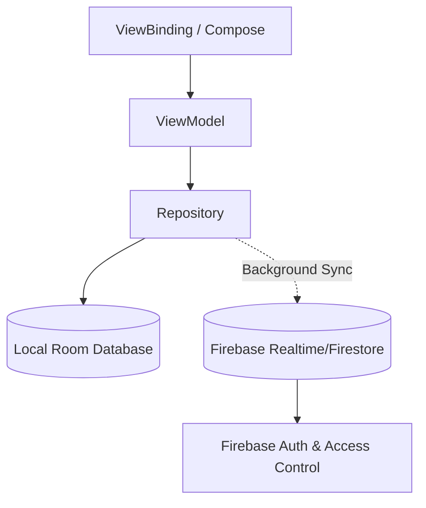

# Mobile Shop Manager v6.0

An offline-first, comprehensive toolkit for mobile shop owners to manage inventory, sales, tracking, repairs, customers, and employees. Built entirely in Kotlin and Jetpack Compose/ViewBinding.

## Feature Matrix
| Category | Features |
| -------- | -------- |
| **Sales & POS** | Cash/Card/Due payments, Bluetooth Thermal Printing, Cart with Discounts |
| **Inventory** | Barcode/IMEI scanning, Stock Alerts, Multi-category Products |
| **Repairs** | Ticketing system, Status Tracking, Advance Payments |
| **Customers** | Contact Book, Dues Tracking, Udhaar Aging |
| **Security** | Role-Based Access Control, App Owner Approvals, Biometric Lock, Secure Auth |
| **Offline-First** | Room Database local storage with background Firebase Sync |
| **Business Logic** | Net Profit Engine, IMEI Lifecycle Tracker, Cash Closing |

## Setup Instructions
1. Clone this repository.
2. Read `SECURITY.md` for `.env` and Firebase setup.
3. Configure `google-services.json` in the `app` directory.
4. Run `gradlew assembleDebug` or build in Android Studio.

## Architecture Diagram

## License
Licensed under Apache License 2.0
